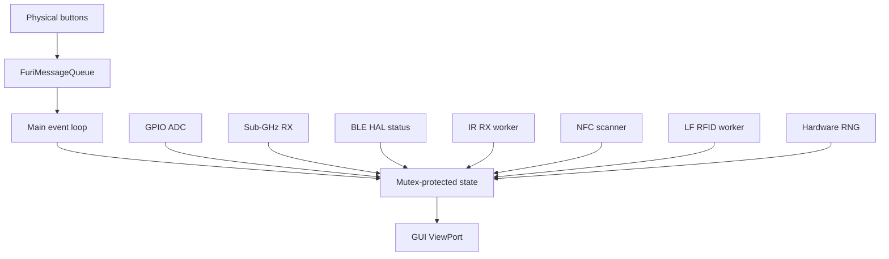

# ONYX FLIPPER LAB

> Defensive hardware-audit utilities for Flipper Zero.

**Fran Gonzas · Software · Systems · Security**

---

## Status

```text
PROJECT     Onyx Flipper Lab
PLATFORM    Flipper Zero
TYPE        External FAP
LANGUAGE    C
BUILD       uFBT / official release SDK
SCOPE       Defensive / authorized / read-only radio
VERSION     2.0
CI          PASSING
```

## Audit modules

| Module | Capability | Write / transmit |
|---|---|---|
| **GPIO Auditor** | Enumerates ADC-capable pins, reads raw ADC and millivolts | No GPIO output |
| **Sub-GHz RSSI** | RX-only RSSI/LQI monitor across common supported bands | No TX |
| **Bluetooth Audit** | Local BLE core state, active-link state, GATT/GAP support, link RSSI | No profile changes |
| **IR Inspector** | Receives and decodes IR protocol/address/command or raw timing count | No IR TX |
| **NFC Detector** | Greedy protocol detection using the official NFC scanner API | No emulation/write |
| **LF RFID Reader** | Auto ASK/PSK identification and limited in-memory data preview | No write/emulation |
| **Password Generator** | 18-character password generated from hardware RNG | Local only |
| **Random HEX** | 8 bytes from hardware RNG | Local only |

The V2 intentionally separates **observation** from **active testing**. Radio and credential-oriented modules are receive/read-only.

---

## Interface

```text
┌──────────────────────────┐
│ ONYX AUDIT LAB           │
├──────────────────────────┤
│ > GPIO auditor           │
│   SubGHz RSSI            │
│   Bluetooth audit        │
│   IR inspector           │
│   NFC detector           │
│   LF RFID reader         │
│   Password generator     │
│   Random HEX             │
│   Security tips          │
│   About                  │
└──────────────────────────┘
```

Controls:

- **UP / DOWN** — navigate.
- **LEFT / RIGHT** — switch GPIO pin or Sub-GHz band where applicable.
- **OK** — sample/regenerate/advance.
- **BACK** — stop the current module safely and return to the menu.

---

## Defensive architecture



Asynchronous NFC, IR and LF-RFID callbacks only copy bounded results into application state. The GUI reads that state under a mutex.

---

## Build

Install uFBT:

```bash
python3 -m pip install --upgrade ufbt
```

Build:

```bash
ufbt
```

Build, upload and launch over USB:

```bash
ufbt launch
```

GitHub Actions also compiles the project automatically against the official Flipper release SDK and publishes the generated `.fap` as an artifact.

---

## Important Bluetooth limitation

The public external-app SDK exposes useful Bluetooth HAL/status functions, but it does **not** expose a stable generic BLE advertisement scanner suitable for an external FAP.

For that reason the Bluetooth module reports local controller/link posture and RSSI rather than relying on private firmware internals. This is intentional: the project should remain compatible with the public SDK instead of silently depending on unstable private APIs.

---

## Security boundaries

```text
RX_FIRST
READ_ONLY_CREDENTIAL_MEDIA
NO_SUBGHZ_TX
NO_IR_TX
NO_NFC_EMULATION
NO_RFID_WRITE
NO_REPLAY
NO_BRUTE_FORCE
NO_JAMMING
NO_HIDDEN_PERSISTENCE
AUTHORIZED_SYSTEMS_ONLY
```

See:

- [Audit modules](./docs/AUDIT-MODULES.md)
- [Architecture](./docs/ARCHITECTURE.md)
- [Build guide](./docs/BUILD.md)
- [Security policy](./SECURITY.md)

---

## Project structure

```text
Onyx-Flipper-Lab/
├── application.fam
├── onyx_flipper_lab.c
├── README.md
├── SECURITY.md
├── LICENSE
├── docs/
│   ├── ARCHITECTURE.md
│   ├── AUDIT-MODULES.md
│   └── BUILD.md
└── .github/
    └── workflows/
        └── build.yml
```

---

## Ethical scope

Use hardware-security and radio-analysis tools only on devices, systems and infrastructure that you own or are explicitly authorized to assess.

© 2026 Fran Gonzas
