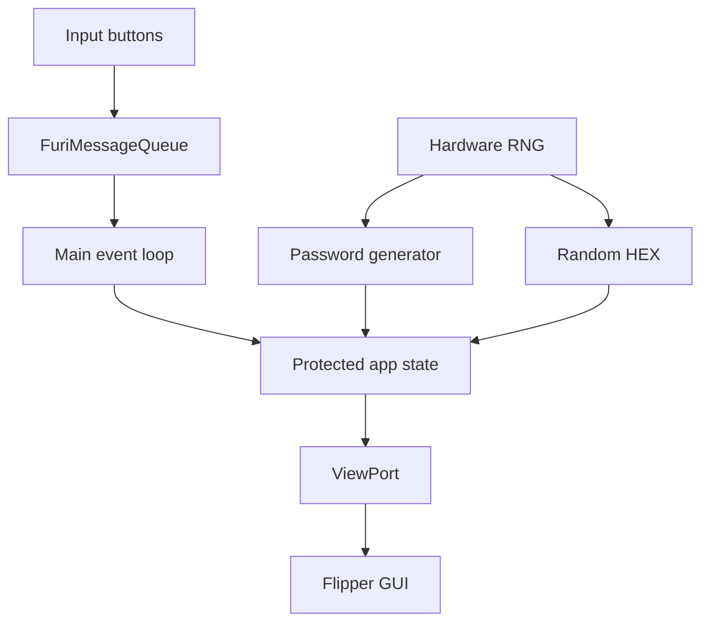

# ONYX FLIPPER LAB

> Defensive utilities and hardware-security learning tools for Flipper Zero.

**Fran Gonzas · Software · Systems · Security**

---

## Status

```text
PROJECT     Onyx Flipper Lab
PLATFORM    Flipper Zero
TYPE        External FAP
LANGUAGE    C
BUILD       uFBT / official SDK
SCOPE       Defensive / educational / authorized
VERSION     1.0
```

## What it does

Onyx Flipper Lab is a small, deliberately safe utility suite for Flipper Zero.

### v1.0

- **Password Generator** — creates an 18-character password locally using Flipper's hardware RNG.
- **Random HEX** — generates and displays 8 random bytes from the hardware RNG.
- **Security Tips** — compact defensive engineering reminders.
- **GPIO Safety** — read-only wiring safety reminders; the app does not drive GPIO pins.
- **About** — project identity and version.

The app **does not transmit, emulate or attack anything** in v1.0.

---

## Interface

```text
┌──────────────────────────┐
│ ONYX FLIPPER LAB         │
├──────────────────────────┤
│ > Password generator     │
│   Random HEX             │
│   Security tips          │
│   GPIO safety            │
│   About                  │
└──────────────────────────┘
```

Controls:

- **UP / DOWN** — navigate.
- **OK** — open / regenerate.
- **BACK** — return to menu; from the main menu it exits.

---

## Architecture



A mutex protects shared UI state between the main application loop and the GUI draw callback.

---

## Build

The recommended development tool is **uFBT**.

### Install uFBT

```bash
python3 -m pip install --upgrade ufbt
```

### Build

From the repository root:

```bash
ufbt
```

The generated `.fap` is placed in the `dist/` directory.

### Build, upload and launch over USB

Connect your Flipper Zero and run:

```bash
ufbt launch
```

The firmware SDK used to compile the FAP must be compatible with the firmware installed on the device.

---

## Continuous integration

GitHub Actions uses the official **flipperdevices/flipperzero-ufbt-action** against the official release SDK.

Every push to `main` builds a real FAP and publishes it as a workflow artifact.

---

## Security design

```text
authorization_first
no_radio_transmission
no_gpio_output
no_credential_storage
no_hidden_persistence
no_third_party_targeting
hardware_rng_for_random_generation
```

Passwords and random bytes are generated in RAM and are not intentionally persisted or transmitted by the application.

See [SECURITY.md](./SECURITY.md) and [docs/ARCHITECTURE.md](./docs/ARCHITECTURE.md).

---

## Project structure

```text
Onyx-Flipper-Lab/
├── application.fam
├── onyx_flipper_lab.c
├── README.md
├── SECURITY.md
├── LICENSE
├── docs/
│   ├── ARCHITECTURE.md
│   └── BUILD.md
└── .github/
    └── workflows/
        └── build.yml
```

---

## Ethical scope

Use security tools only on devices, systems and infrastructure that you own or are explicitly authorized to test.

This repository is designed for defensive engineering, education and experimentation.

---

© 2026 Fran Gonzas
